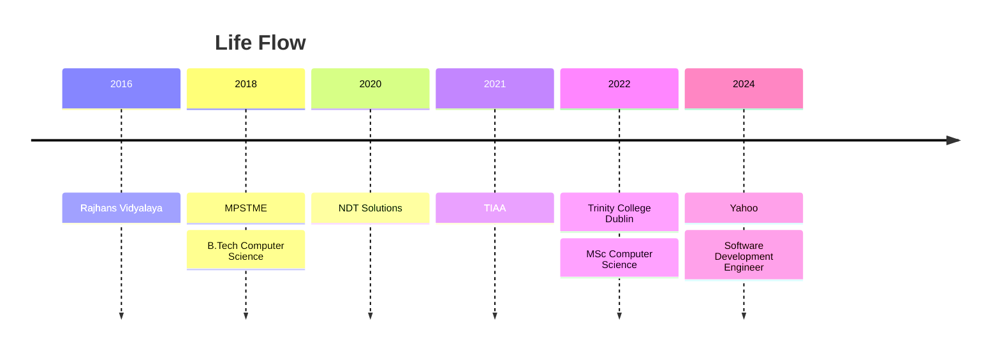

## Hey there! 👋

I'm Hamza Gabajiwala, a Software Development Engineer at Yahoo working on large-scale data pipelines and audience targeting systems that power programmatic advertising for hundreds of millions of users. I build and maintain batch scoring pipelines using Apache Spark, Airflow, and Kafka on AWS, and I've recently been integrating GenAI/LLM capabilities into our search retargeting systems.

I hold an M.Sc. in Computer Science from Trinity College Dublin (1:1) and a B.Tech in Computer Engineering from NMIMS University.

- 🔭 Building data pipelines and audience scoring systems at **Yahoo**
- 🛠️ Working with `Python, Scala, Spark, Airflow, Kafka, AWS (EMR, S3, Glue), OpenSearch`
- 🤖 Integrating LLMs into ad-tech search retargeting pipelines
- 📫 How to reach me: <a href="mailto:hamzajg16@gmail.com">hamzajg16@gmail.com</a>

## Life Flow

## Connect with Me 🤝

  
  

