<a href="https://www.hamzagabajiwala.com">
  <picture>
    <source media="(prefers-color-scheme: dark)" srcset="assets/hero-dark.svg">
    
  </picture>
</a>

  
  
  
  
  
  
  
  
  
  

  <a href="https://www.hamzagabajiwala.com">Website</a> &nbsp;/&nbsp;
  <a href="https://www.linkedin.com/in/hamza-gabajiwala">LinkedIn</a> &nbsp;/&nbsp;
  <a href="mailto:hamzajg16@gmail.com">Email</a>

 

<a href="mailto:hamzajg16@gmail.com">
  <picture>
    <source media="(prefers-color-scheme: dark)" srcset="assets/hello-dark.svg">
    
  </picture>
</a>
