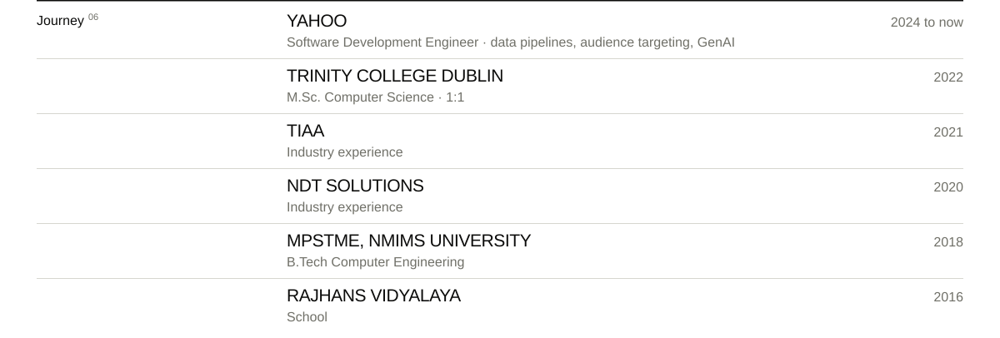

  
  
  
  
  
  
  
  
  
  

<a href="https://www.hamzagabajiwala.com"><picture>
    <source media="(max-width: 640px) and (prefers-color-scheme: dark)" srcset="assets/link-website-m-v3-dark.svg">
    <source media="(max-width: 640px)" srcset="assets/link-website-m-v3-light.svg">
    <source media="(prefers-color-scheme: dark)" srcset="assets/link-website-v3-dark.svg">
    
  </picture></a>
<a href="https://www.linkedin.com/in/hamza-gabajiwala"><picture>
    <source media="(max-width: 640px) and (prefers-color-scheme: dark)" srcset="assets/link-linkedin-m-v3-dark.svg">
    <source media="(max-width: 640px)" srcset="assets/link-linkedin-m-v3-light.svg">
    <source media="(prefers-color-scheme: dark)" srcset="assets/link-linkedin-v3-dark.svg">
    
  </picture></a>
<a href="mailto:hamzajg16@gmail.com"><picture>
    <source media="(max-width: 640px) and (prefers-color-scheme: dark)" srcset="assets/link-email-m-v3-dark.svg">
    <source media="(max-width: 640px)" srcset="assets/link-email-m-v3-light.svg">
    <source media="(prefers-color-scheme: dark)" srcset="assets/link-email-v3-dark.svg">
    
  </picture></a>

<picture>
    <source media="(max-width: 640px) and (prefers-color-scheme: dark)" srcset="assets/about-m-v3-dark.svg">
    <source media="(max-width: 640px)" srcset="assets/about-m-v3-light.svg">
    <source media="(prefers-color-scheme: dark)" srcset="assets/about-v3-dark.svg">
    
  </picture>

<picture>
    <source media="(max-width: 640px) and (prefers-color-scheme: dark)" srcset="assets/journey-m-v3-dark.svg">
    <source media="(max-width: 640px)" srcset="assets/journey-m-v3-light.svg">
    <source media="(prefers-color-scheme: dark)" srcset="assets/journey-v3-dark.svg">
    
  </picture>

