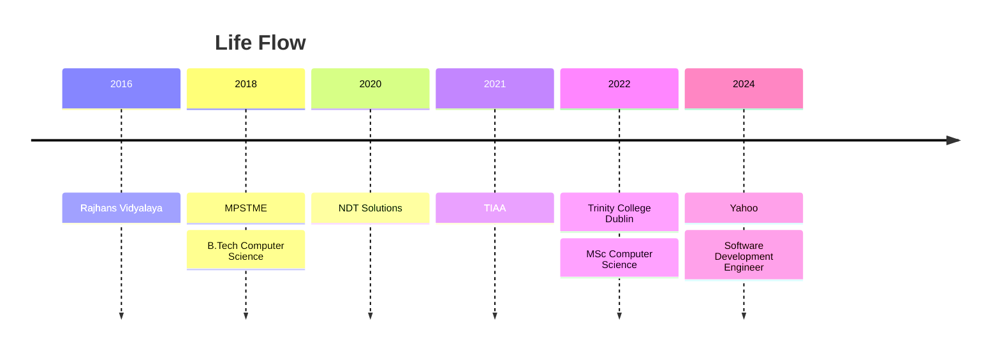

# Hey there, I'm Hamza Gabajiwala 👋

### Software Development Engineer @ Yahoo · Data Pipelines · Ad-Tech · GenAI

  
  
  

---

## 👨‍💻 About Me

I work on large-scale data pipelines and audience targeting systems that power programmatic advertising for **hundreds of millions of users**. I build and maintain batch scoring pipelines using Apache Spark, Airflow, and Kafka on AWS, and I've recently been integrating **GenAI/LLM** capabilities into our search retargeting systems.

- 🔭 Building data pipelines and audience scoring systems at **Yahoo**
- 🤖 Integrating LLMs into ad-tech search retargeting pipelines
- 🎓 M.Sc. Computer Science, **Trinity College Dublin** (1:1)
- 🎓 B.Tech Computer Engineering, **NMIMS University**
- 📫 Reach me at [hamzajg16@gmail.com](mailto:hamzajg16@gmail.com)

## 🛠️ Tech Stack

  
  
  
  
  
  
  

| Area | Tools |
| :-- | :-- |
| **Languages** | Python, Scala |
| **Big Data** | Apache Spark, Kafka, Airflow |
| **Cloud** | AWS (EMR, S3, Glue) |
| **Search** | OpenSearch |
| **AI** | LLM / GenAI integration |

## 📈 GitHub Stats

  
  

## 🧭 Life Flow

## 🤝 Let's Connect

  
  

